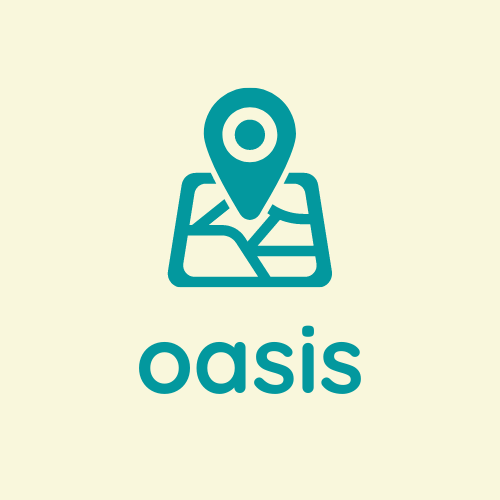

###

<!-- PROJECT LOGO -->
 

  

  <h1 align="center">Oasis</h1>

  

    The best source for authentic travel experiences
     
    <a href="https://github.com/TeamImpossible/oasis/"><strong>🔍Explore the docs »</strong></a>
     
     
    <a href="#">👀 View Demo</a>
    ·
    <a href="https://github.com/TeamImpossible/oasis/">🐛Report Bug</a>
    ·
    <a href="https://github.com/TeamImpossible/oasis/">✍🏽Request Feature</a>
  

<!-- TABLE OF CONTENTS -->

  
Table of Contents

  <ol>
      <ul>
        <li><a href="#what-it-does">What It Does</a></li>
         <li><a href="#how-we-intend-to-build-it">How We Intend to Build It</a></li>
      </ul>
    </li>
    <li><a href="#built-with">Built With</a></li>
    <li><a href="#acknowledgements">Acknowledgements</a></li>
    <li><a href="#our-team">Our Team</a></li>
  </ol>

<!-- ABOUT THE PROJECT -->

## What It Does 
The best source for authentic travel experiences and recommendations of places to go and things to do no matter where you find yourself.

## How We Intend to Build It 

We will build our wireframes and prototypes using Figma. We will build our project over three months using Kotlin, Google Maps API...

<!-- BUILT WITH -->
## Built With 

Major frameworks that we will build our project using.

* [Kotlin](https://kotlinlang.org/)
* [Google Maps Android SDK](https://developers.google.com/maps/documentation/android-sdk/overview)

<!-- ACKNOWLEDGEMENTS -->
## Acknowledgements, Add-ons, Plugins

* [Figma](https://www.figma.com/)

<!-- CONTACT -->
## Our Team

* Leesel Fraser - [LinkedIn](https://www.linkedin.com/in/leesel/)
* Dianique Ashley - [LinkedIn](https://www.linkedin.com/in/)
* Rekkai Steed - [LinkedIn](https://www.linkedin.com/in/)
* Iesha Usher - [LinkedIn](https://www.linkedin.com/in/)
* Domonique Churchhill - [LinkedIn](https://www.linkedin.com/in/)

<!-- MARKDOWN LINKS & IMAGES -->
<!-- https://www.markdownguide.org/basic-syntax/#reference-style-links -->
[contributors-shield]: https://img.shields.io/github/contributors/TeamImpossible/oasis/
[contributors-url]: https://github.com/TeamImpossible/oasis/
[forks-shield]: https://img.shields.io/github/forks/TeamImpossible/oasis/
[forks-url]: https://github.com/TeamImpossible/oasis/
[stars-shield]: https://img.shields.io/github/stars/TeamImpossible/oasis/
[stars-url]: https://github.com/TeamImpossible/oasis/
[issues-shield]: https://img.shields.io/github/issues/TeamImpossible/oasis/
[issues-url]: https://github.com/TeamImpossible/oasis/
[license-shield]: https://img.shields.io/github/license/TeamImpossible/oasis/
[license-url]: https://github.com/TeamImpossible/oasis/
